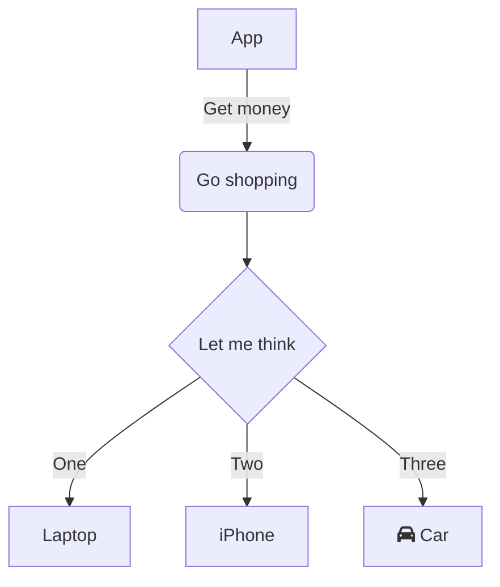

## Functional

 - Lock all bag lockers
 - Get geoposition to phone app
 - Syncronise with phone from BT

## Modules

- Arduino
- GPS module ( `Class geoposition` )
- Sim-card module ( `Class gsm` )
- Bluetooth module ( `Class blue` )
- Motor/Servo for locking ( `Class locker` )
- LED tape ( `Class blink` )

## Logic hardware

1. У нас есть `gps модуль` и `симкардовский модуль`, тогда надобность в `BT` отпадает, потому что можно по принципу Матвееных часов отправлять все на сервер `смсками` или по `GSM`(когда на телефоне E включается) запросы и ответы, и тогда телефону чтобы заблокировать рюкзак придется использовать интернет. Но из за этого возникает еще больше вопросов...
2. Мы можем убрать `gps/sim` и оставить только `BT`. У BT можно узнать дальность рюкзака от телеыона с точностью до сантиметра. Что это даёт: Как только человек отходит от рюкзака на `<N>` расстояние мы блокируем рюкзак и если рюкзак начинает двигаться включаем `<Что то>`(хотел сказать сирену но будет оч много лишних срабатываний), надо придумать что.
3. Как разблокировать рюкзак когда он разряжен или разряжен телефон. Со вторым более менее понятно, но с первым неоч. Возможно стоит не блокировать рюкзак если он сел, тобиж перед выключением открывать замки. Идея в том что его уже украли и так и так вскроют, поэтому смысла уже нет закрывать. Но тогда теряется фишка(Украли и вскрой, если сможешь)

### Фичи о которых говорили

- Супер защищенный режим. Надо описать подробнее и продумать до мелочей
- Повседневный(Энергосберегающий) режим. Тоже надо продумать, из чего состоит, что включено, какие модули, какое поведение при `<N>` поведении
- Приложение, взаимодействие с пользователем. Как именно человек будет открывать закрывать блокировать и тп наш рюкзак
- Цена - очень важный момент, может стать киллер фичей
